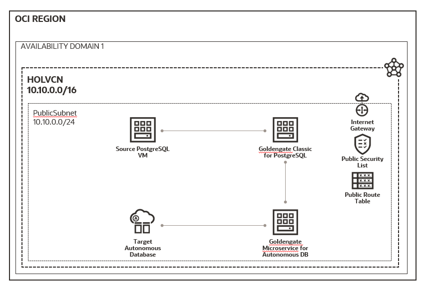
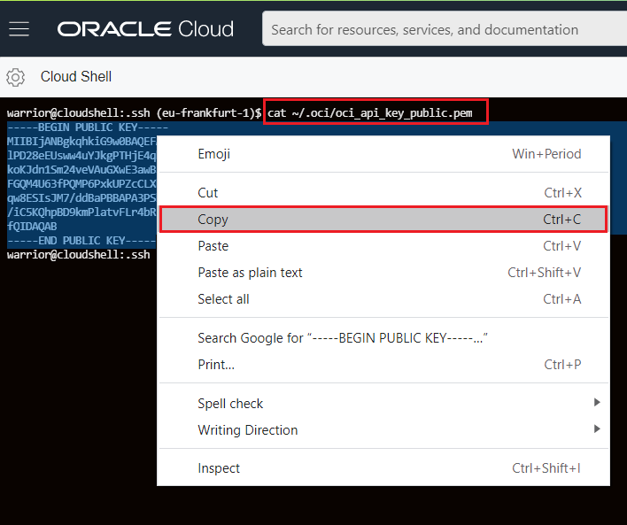
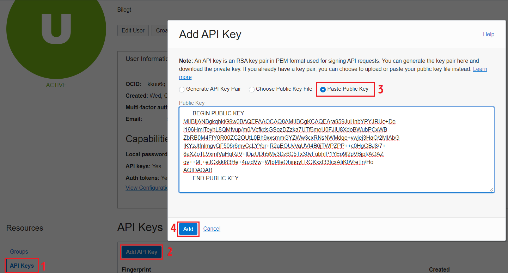
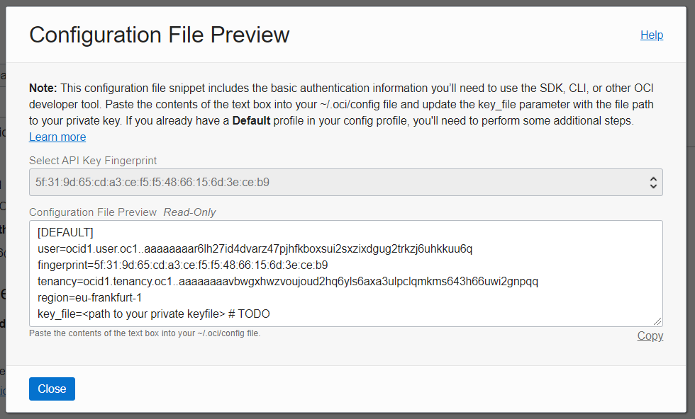
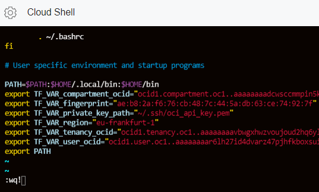

# migrate_to_atp
Hello Folks! Welcome to migrate to autonomous database lab.

In this lab we will migrate a postgresql database to an Autonomous database in Oracle Cloud Infrastructure. We will use Oracle Goldengate for migration steps, and all of our services will be hosted in OCI for this lab purpose. This lab has 2 steps.

In step 1, we will use terraform to create and prepare our work environment:

- Virtual Cloud Network: we will create a VCN with public sub network and internet access to avoid complexity.
- Source Postgreqsql database: we will create a Postgresql database server in a Virtual Machine, acts as our source on-premise databas.
- Goldengate for non-Oracle deployment: we will create a Goldengate classic for Postgresql which will extract data from source and ships trails to cloud.
- Goldengate Microservices deployment: we will create a Microservices environment for Autonomous database which applies trails from source to target autonomous database.
- Target Autonomous database: we will provision Oracle Autonomous database acts as our target database.



In step 2, Oracle Goldengate configuration will consist of followings:

- Extract exttab process at Goldengate for non-Oracle database, it is known as change data capture for continuous replication.
- Extract extdmp process at Goldengate for non-Oracle database, it will ship our captured trail files to Microservices for continuous replication.
- Extract initload process at Goldengate for non-Oracle database, it is our first data loader process and inserts to ATP.
- Replicate process at Microservices, it will apply trail files captured by initload process.


## Prerequisites 

- Get your Oracle cloud account first!

If you don't have an OCI account, you can sign up for a free trial [here](). 

- Let's prepare our work directory. 

We will use something called Cloud Shell in OCI web console, which is simple and sophisticated cloud terminal for the most of your need. It is located right top corner of OCI web console


Once cloud shell environment is ready, issue below commands:

```
  ssh-keygen -t rsa -N "" -b 2048 -f ~/.ssh/oci
  
  openssl genrsa -out ~/.ssh/oci_api_key.pem 2048
  
  openssl rsa -pubout -in ~/.ssh/oci_api_key.pem -out ~/.ssh/oci_api_key_public.pem
  
  openssl rsa -pubout -outform DER -in ~/.ssh/oci_api_key.pem | openssl md5 -c | awk '{print $2}' > ~/.ssh/oci_api_key.fingerprint
  
  cat ~/.ssh/oci_api_key_public.pem
  
```
and copy your public pem file content.



Now, click on right top corner of your OCI web console, and click on your profile. Then navigate to "API Keys" from left pane and click on "Add API Key" button. Small pop-up will appear and you need to choose "Paste Public Key" radiobutton. Paste your copied public pem key there and click on "Add" button.



A small confirmation will show after you added an API key. Copy those values and open a notepad to modify them.



In your notepad, modify following:
```
  export TF_VAR_compartment_ocid="your-tenancy-value-goes-here"
  export TF_VAR_fingerprint="your-fingerprint-value-goes-here"
  export TF_VAR_private_key_path="~/.ssh/oci_api_key.pem"
  export TF_VAR_region="your-region-value-goes-here"
  export TF_VAR_tenancy_ocid="your-tenancy-value-goes-here"
  export TF_VAR_user_ocid="your-user-value-goes-here"
```


After you modified above using your parameters/values, now we we will save it to ".bash_profile", to do so go to your terminal and issue:
```
  vi ~/.bash_profile
```

*NOTE: Edit a file uses **vi** editor, if you never used it before here is little instruction. 
When you issue **vi some_file_name** it will either open if that some_file_name exists or create a new file called some_file_name. 
You have to press **i** for editing the file, then if you are done editing press **:wq** keys then hit enter for save & quit.*



then issue following to use variables you added to ".bash_profile" file.
```
  . ~/.bash_profile
```
You've done with prerequisites.

## Step 1

## Step 2
